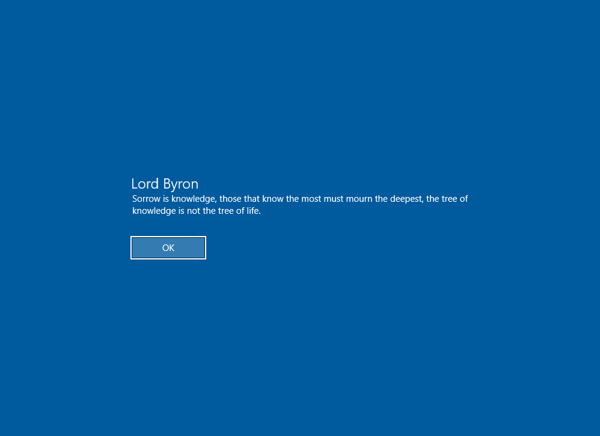

# signin-quote 🗣️📖

A python program that gives the user a random quote prompt after signing into Windows!

Each time this program runs, it pulls quote data from an API and passes it as arguments to a batch script 💻

The batch script elevates Powershell and runs a command to update the value data of legalnoticecaption and legalnoticetext in the Registry Editor. 

## ⚠️ REQUIRED ⚠️
Run `pip install requests` (or `pip3 install requests` for python3) 

Web source: https://pypi.org/project/requests/ to install the requests library

## Demo Images 🖼️

   
   

## Default Settings 🧑‍🔧
Run the Command Prompt (cmd) or PowerShell as administrator, then commands:

`reg add HKLM\SOFTWARE\Microsoft\Windows\CurrentVersion\Policies\System /v legalnoticecaption /t REG_SZ /d "" /f`

`reg add HKLM\SOFTWARE\Microsoft\Windows\CurrentVersion\Policies\System /v legalnoticetext /t REG_SZ /d "" /f`

or manually follow the path in the Registry Editor and modify the value data for both legalnoticecaption and legalnoticetext
